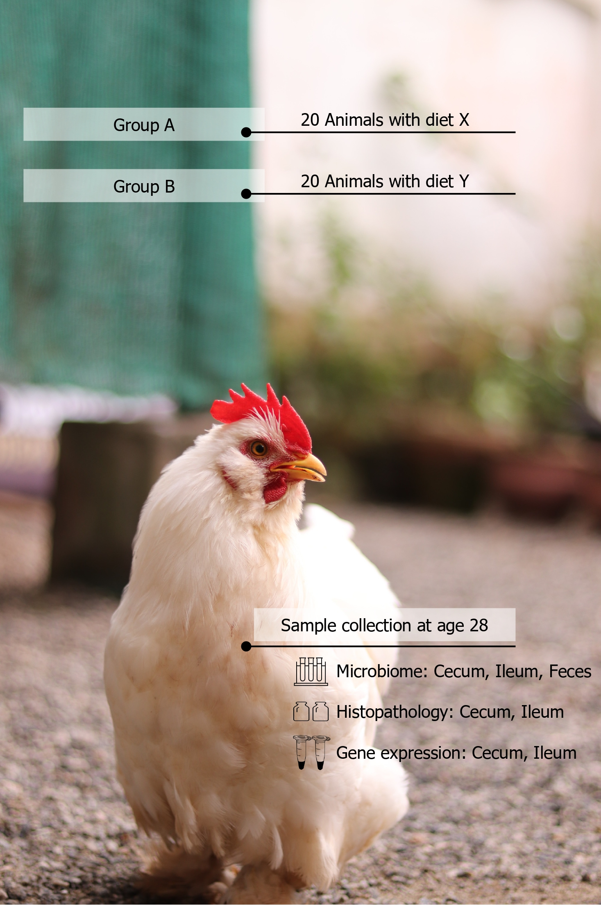
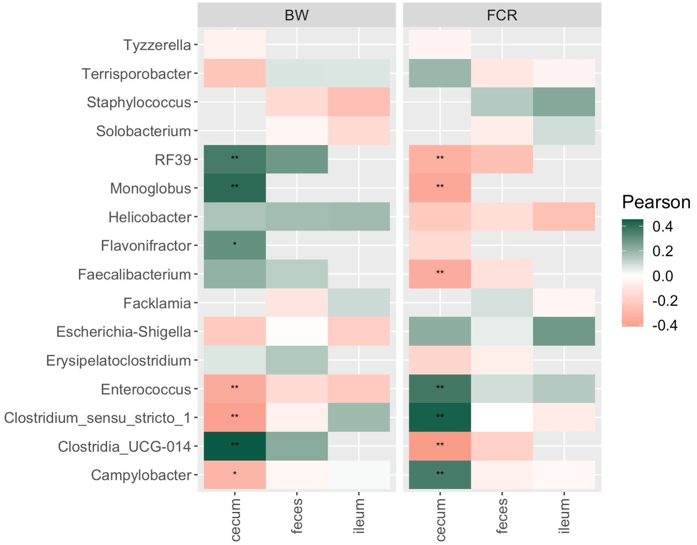
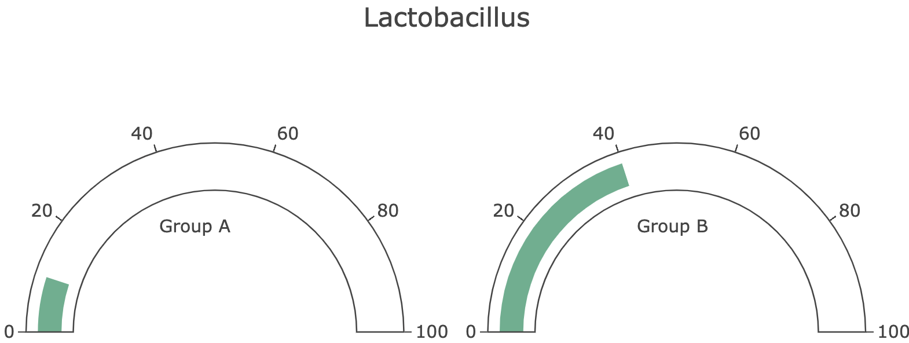

```{r setup, include=FALSE}
knitr::opts_chunk$set(echo = TRUE)
```

```{css, echo=FALSE}
.center {
  display: table;
  margin-right: auto;
  margin-left: auto;
}
```

```{r , echo=FALSE, include=TRUE}
# load data in 'global' chunk so it can be shared by all users of the dashboard
library(phyloseq)
library(ggplot2)
library(genefilter)
library(shinydashboard)
library(devtools)
library(tidyr)
library(flexdashboard)
library(kableExtra)
library(microbiome)
library(plyr)
library(plotly)
library(stringr)
library(microbiomeutilities)
library(microViz)
library(gtools)
library(ggpubr)
library(reshape2)
library(DT)

setwd("/Users/dvarelat/Documents/SIWA/DashDemo")
source("functions.R")

folder <- "/Users/dvarelat/Documents/SIWA/Reports/Version1.0/Input_data/"
ODLEPobj <- readRDS(paste0(folder, "phyloseqObject_April11.rds"))
ODLEPobj_cecum<-subset_samples(ODLEPobj, SampleLocation=="C")
ODLEPobj_ileum<-subset_samples(ODLEPobj, SampleLocation=="I")
ODLEPobj_feces<-subset_samples(ODLEPobj, SampleLocation=="F")


pseq.rel_cecum <- microbiome::transform(ODLEPobj_cecum, "compositional")
pseq.rel_ileum <- microbiome::transform(ODLEPobj_ileum, "compositional")

```


Project description {data-icon="fa-table"}
===================================== 

Row {data-height=600}
-------------------------------------

### {data-width=600}

```{r picture, include= TRUE, echo=FALSE}


cvi_colours = list(
  cvi_siwa = c("#03343a", "#4e8e74","#f99b35",  "#e5c217",  
               "#075b44", "#f9b870", "#f7e76d", 
                  "#017fb1", "#5cb08e" , "#fcd8b6", "#fcf5cd", "#ABF4D4",
               "#8CDBF4","#F7927F"),
  
  alpha_colors = c( "#075b44",  "#017fb1", "#ABF4D4"),
  groups_beta = c( "#075b44", "#f9b870" ), 
  groups_scores = c("#f9b870","#ABF4D4"),
  groups=c("#4e8e74", "#035060", "#f99b35", "#BC8808")
)

cvi_palettes = function(name, n, all_palettes = cvi_colours, type = c("discrete", "continuous")) {
  palette = all_palettes[[name]]
  if (missing(n)) {
    n = length(palette)
  }
  type = match.arg(type)
  out = switch(type,continuous = grDevices::colorRampPalette(palette)(n),discrete = palette[1:n]
  )
  structure(out, name = name, class = "palette")
}

scale_color_cvi_d = function(name) {
  ggplot2::scale_colour_manual(values = cvi_palettes(name, type = "discrete"))
}
scale_fill_cvi_d = function(name) {
  ggplot2::scale_fill_manual(values = cvi_palettes(name,type = "discrete"))
}
```

### {data-width=300}

**Tracking the impact of a probiotic product on broiler GI health**

Two diets, a basal diet and the basal diet with the addition of a probiotic product, were fed to broiler chickens from day of hatch to 42 days of age.  The purpose of this trial was to evaluate the impact of the probiotic product on the health of the GI and its microbiome.  This analysis focuses on samples collected at 28 days of age.  Samples were collected from 20 birds/diet; the samples were ileal and cecal tissue samples for histopathological evaluation and gene expression analysis, as well as feces, ileal and cecal digesta for microbiome analysis.  

The results of each analysis are presented individually, and additional cross-panel analyses are used to demonstrate relationships between these results.

# Exploration {data-navmenu="Microbiome"}

Row {data-height=120}
-----------------------------------------------------------------------
Sequences identified during the sequencing process are grouped in batches of identical sequences so that the number of times that sequences was found can be recorded. This is the abundance of the sequence. The groups of identical sequences are called Operational Taxonomic Units 
<a href="https://en.wikipedia.org/wiki/Operational_taxonomic_unit" target="_blank">(OTUs)</a> or Amplicon Sequence Variants <a href="https://en.wikipedia.org/wiki/Amplicon_sequence_variant" target="_blank">(ASVs)</a>, and they often (but not always) correspond to species or genera of bacteria. In the Figure 1 we can observe the prevalence of OTUs across all samples (the fixed threshold for an OTU to be considered present in a sample is 0.1% relative abundance). 


Row {data-height=500}
-----------------------------------------------------------------------
### {data-width=350}

The sequencing process identified more than 1300 unique sequences, and as expected, only a few OTUs are shared by the majority of samples (Fig1). Percentages in each graph indicate the percentage of OTUs in that site that are present in at least 50% of the samples. As seen in the graph, most are rare taxa detected in only a small portion of samples. It is common to find a small number of OTUs which are dominant in the community, while most others are much less abundant and they are unlikely to be biologically related to any performance or treatment-based effects. Only ~3% of OTUs in the feces are shared by more than 50% of samples, while in the cecum this number is ~8%. 

This means that cecal samples tend to have more microbes in common than fecal samples. 

### FIGURE 1: Prevalence of OTUs in samples. {data-width=650}

```{r, fig.height = 3, echo=FALSE}
source("prevalence_plot.R")

p <- prevalence(ODLEPobj_cecum, ODLEPobj_ileum, ODLEPobj_feces)

figure <- ggarrange(p[[1]]$cecum, p[[1]]$ileum , p[[1]]$feces, 
                    ncol = 1, nrow = 3,
                    font.label = list(size = 9, color = "black", face = "plain"))
annotate_figure(figure,
                bottom = text_grob("OTUs in order of prevalence"), 
                left = text_grob("Samples in which OTU is present (%)", rot=90)) 

```

Row {data-height=30}
-----------------------------------------------------------------------


Row {data-height=90}
-----------------------------------------------------------------------

After filtering low-abundance sequences, the remaining data can be explored more easily. Exploring the distribution of sequences at different taxonomic levels can help us understand the general microbiome composition of the samples in the experiment as a whole.  

Row {data-height=500}
-----------------------------------------------------------------------
### {data-width=200}

In Figure 2, we can observe the prevalence and abundance of the remaining OTUs at the phylum level. Each point is a different OTU, prevalence in the Y axis is the proportion of samples in which each OTU is present. The x axis is the average abundance of each OTU. 

### FIGURE 2: Prevalence of Phyla. {data-width=800}

```{r, echo=FALSE, include=TRUE, fig.height = 3, fig.width= 5}
pseq.rel <- microbiome::transform(ODLEPobj, "compositional")
flist    <- filterfun(kOverA(5, 2e-05))
ODLEPobjRelFilter =  filter_taxa(pseq.rel, flist, TRUE)
p <- plot_taxa_prevalence(ODLEPobjRelFilter, "Phylum")
p <- p + theme(legend.position='none') + theme(strip.text.x = element_text(size = 10), text = element_text(size = 10))

ggplotly(p + scale_color_cvi_d("cvi_siwa"),  height = 380) %>% 
 layout( 
 xaxis = list(automargin=TRUE), 
 yaxis = list(automargin=TRUE)
 ) %>% 
  style(hoverinfo = 'none') %>% partial_bundle() 

```


Row {data-height=80}
-----------------------------------------------------------------------

# Diversity {data-navmenu="Microbiome"}

Row {data-height=40}
-----------------------------------------------------------------------
Microbiome diversity can be assessed through multiple ecological indices that can be divided into two kinds of measures, alpha and beta diversity. <a href="https://en.wikipedia.org/wiki/Alpha_diversity" target="_blank">Alpha diversity</a> measures the variability of species within a sample while <a href="https://en.wikipedia.org/wiki/Beta_diversity" target="_blank">beta diversity</a> accounts for the differences in composition between samples.


Row {data-height=30}
-----------------------------------------------------------------------
*Richness* = This index represents the number of observed OTUs or features in the sample.

Row {data-height=30}
-----------------------------------------------------------------------
*Shannon diversity* = This index is an estimate of how complex the community is.

Row {data-height=10}
-----------------------------------------------------------------------

Row {data-height=500}
-----------------------------------------------------------------------

### {data-width=300}

In poultry, the **cecal** microbiome tends to be very rich, while the small intestines and feces usually have a smaller number of bacterial species.  While each region of the gut has different ranges of richness/diversity, higher diversity is usually associated with better health status. 

These methods can be used to evaluate changes in richness between study groups and populations, not only between GI regions.


### FIGURE 3: Diversity by sample location: Cecum, Ileum, Feces. {data-width=700}

```{r , echo=FALSE, fig.height = 3, fig.width= 6}
pdiv <-
  plot_anova_diversity_edit(
    ODLEPobj,
    method = c("richness", "shannon"),
    grouping_column =  "SampleLocation",
    pValueCutoff = 0.05
  ) +
  xlab(NULL) + ylab(NULL) + theme(legend.position = "none")

pdiv <- pdiv + scale_color_cvi_d("alpha_colors") + theme(strip.text.x = element_text(size = 10), text = element_text(size = 10))
pdiv

```

Row {data-height=40}
-----------------------------------------------------------------------

Row {data-height=500}
-----------------------------------------------------------------------

### {data-width=300}

There are many dietary and environmental variables that can affect the diversity and stability of the microbiome.  In this study, addition of a probiotic resulted in less animal to animal variability in richness, and a minor decrease in richness in the ileum, perhaps related to an increased dominance of the probiotic itself.

### FIGURE 4: Diversity by groups. {data-width=700}

```{r, echo=FALSE, fig.height = 3, fig.width= 6}

plot_alpha <- readRDS("plot_div.rds")

plot_alpha  + theme(strip.text.x = element_text(size = 10), text = element_text(size=10)) + scale_color_cvi_d("alpha_colors")

```

Row {data-height=80}
-----------------------------------------------------------------------


# Composition {data-navmenu="Microbiome"}

Row {data-height=20}
-----------------------------------------------------------------------

Row {data-height=500}
-----------------------------------------------------------------------

### {data-width=350}

In addition to population richness, we also want to understand the composition of the microbiome in different groups.  For this we use methods that evaluate the **"compositional"** distance between samples. These distances (In our case Bray Curtis dissimilarities) are often visualized with a method called **principal coordinates analysis (PCoA)**. Each axis represents a combination of features (OTUs) that account for high amounts of variation between samples. The percentage of the differences for which this combination of features accounts is shown on the axis. Each dot in the figure is a sample. Samples that are on opposite ends of an axis that accounts for a high percentage of variability are likely to be more different than samples that are on opposite ends of an axis that only accounts for low percentage of the total variability.

These analyses evidenced clear differentiation between samples of different gut locations (pval=0.001), which was biologically expected since different locations of the gut have different dynamics, roles and environmental conditions.

### FIGURE 5: Dissimilarity between all samples (Bray distances). {data-width=650}

```{r beta, include=TRUE, echo=FALSE}
out.bray <-
    ordinate(
      ODLEPobj, method = "MDS", 
      distance = "bray")
p <- plot_ordination(
    ODLEPobj,
    out.bray,
    color = "Group",
    axes = c(1, 2),
    justDF = FALSE
  )
df <- p$data
df$SampleLocation <- as.factor(df$SampleLocation)
plot <- ggplot(df, aes(
    x = Axis.1,
    y = Axis.2,
    color = SampleLocation)) +
    geom_point(size=2) +
    xlab(p$labels$x) + ylab(p$labels$y) + 
   scale_color_cvi_d("alpha_colors")

ggplotly(plot,  height = 400)

```

Row {data-height=40}
-----------------------------------------------------------------------

Row {data-height=30}
-----------------------------------------------------------------------

In this study, there were some compositional differences in the cecum, even though we saw in the previous tab that the richness of the cecum was not affected.

Row {data-height=400}
-----------------------------------------------------------------------

### FIGURE 6: Dissimilarity between groups.

```{r beta2, include=TRUE, echo=FALSE}
out.bray <-
    ordinate(
      ODLEPobj_cecum, method = "MDS", 
      distance = "bray")
p <- plot_ordination(
    ODLEPobj_cecum,
    out.bray,
    color = "Group",
    axes = c(1, 2),
    justDF = FALSE
  )
df <- p$data
df$Calcium_level <- as.factor(df$Calcium_level)
df <- df[df$Calcium_level %in% c(1, 4),]
df$Group <- ifelse(df$Calcium_level == 1, "Group A", "Group B")
plot <- ggplot(df, aes(
    x = Axis.1,
    y = Axis.2,
    color = Group)) +
    geom_point(size=2) +xlab(p$labels$x) + ylab(p$labels$y) + scale_color_cvi_d("groups_beta")

ggplotly(plot,  height = 300)
```

Row {data-height=40}
-----------------------------------------------------------------------

Row {data-height=30}
-----------------------------------------------------------------------

The compositional differences between the diet groups in the cecum can more clearly be seen in these bar plots that compare the primary genera found in each group.  
 
Row {data-height=550}
-----------------------------------------------------------------------

### FIGURE 7: Taxonomic composition between groups. 

```{r , echo=FALSE, fig.width=8, fig.height=3}
## plot ileum cecum --> mirando aparte las importantes de cada uno
genus_to_keep <- function(phyloseq_relative, N = 12) {
  ps.com.gen <-microbiomeutilities::aggregate_top_taxa2(phyloseq_relative, level = "Genus", top= N)
  keep_genus <-
    as.list(as.data.frame(phyloseq::tax_table(ps.com.gen))$Genus)
  keep_genus <- keep_genus[keep_genus != "UNKNOWN"]
  keep_genus <- keep_genus[keep_genus != "Other"]
  return(keep_genus)
}

keep_genus_cecum <- genus_to_keep(pseq.rel_cecum, 10)
keep_genus_ileum <- genus_to_keep(pseq.rel_ileum, 10)

grouped <- aggregate_taxa_siwa(pseq.rel_cecum, "Genus")
melted <- psmelt(otu_table(grouped, taxa_are_rows = TRUE))
metadata <- sample_data(pseq.rel_cecum)
melted$SampleID <- melted$Sample
melted <- dplyr::left_join(melted, metadata, by="SampleID")
melted$label <-as.character(if_else(melted$OTU %in% keep_genus_cecum, melted$OTU, "Others"))
df <- melted[, c("label", "Abundance", "KitID")]
df <- df[df$KitID %in% c(72, 73), ]
df_agg_cecum<-aggregate(df$Abundance,
          by = list(df$label, df$KitID),FUN = sum)
colnames(df_agg_cecum) <-c("Genus", "KitID", "Abundance")
df_agg_cecum$Location <- "Cecum"
grouped <- aggregate_taxa_siwa(pseq.rel_ileum, "Genus")
melted <- psmelt(otu_table(grouped, taxa_are_rows = TRUE))
metadata <- sample_data(pseq.rel_ileum)
melted$SampleID <- melted$Sample
melted <- dplyr::left_join(melted, metadata, by="SampleID")
melted$label <-as.character(if_else(melted$OTU %in% keep_genus_ileum, melted$OTU, "Others"))
df <- melted[, c("label", "Abundance", "KitID")]
df <- df[df$KitID %in% c(72, 73), ]
df_agg_ileum<-aggregate(df$Abundance,
          by = list(df$label, df$KitID),FUN = sum)
colnames(df_agg_ileum) <-c("Genus", "KitID", "Abundance")
df_agg_ileum$Location <- "Ileum"
df_agg <- rbind(df_agg_cecum, df_agg_ileum)

df_agg$Group <- ifelse(df_agg$KitID == 72, "Group A", "Group B")

### para que concuerde con DA analysis
df_agg[df_agg$Genus == "[Ruminococcus]_torques_group", "Genus"] <- c("Streptococcus","Streptococcus")
df_agg[df_agg$Genus == "Subdoligranulum", "Genus"] <- c("Bifidobacterium","Bifidobacterium")
df_agg[df_agg$Genus == "Corynebacterium", "Genus"] <- c("Turicibacter","Turicibacter")

ggplot(df_agg,
       aes(x = Group,
           y = Abundance,
           fill = Genus,)) +  geom_bar(stat = "identity", position = "fill") + facet_wrap( ~Location, scales = 'free', nrow=1,ncol=2) + scale_fill_cvi_d("cvi_siwa") + theme(axis.text.x = element_text(angle = 60, hjust = 1)) + theme(strip.text.x = element_text(size = 7), text = element_text(size=7)) + xlab("") + guides(fill=guide_legend(ncol=2))

```


Row {data-height=70}
-----------------------------------------------------------------------

Also of interest in many studies is a comparison of pathogenic or potentially harmful bacteria.  In this study, pathogen levels were low overall, and there was no significant difference in levels of tracked pathogens between groups.


Row {data-height=550}
-----------------------------------------------------------------------

### FIGURE 8: Taxonomic composition - some pathogens. 

```{r, include=TRUE, warning=FALSE, echo=FALSE, fig.width=9, fig.height=3}
genus = c('Enterococcus','Streptococcus','Campylobacter',
         'Clostridium_sensu_stricto_1',
         'Corynebacterium ','Terrisporobacter',
         'Clostridioides','Helicobacter','Facklamia',
         'Solobacterium','Proteus','Peptococcus',
         'Escherichia-Shigella','Fusobacterium','Selenomonas',
         'Treponema', "Tyzzerella", "Tyzzerella 3")
rel <-microbiome::transform(ODLEPobj, "compositional")
grouped <- aggregate_taxa_siwa(rel, "Genus")
genus <- genus[genus %in% rownames(grouped)]
df_genus_patho <- grouped[genus, ] 
others_genus <- rownames(grouped)[!(rownames(grouped) %in% genus)]
df_genus_others <- grouped[others_genus, ] 
df_path_vs_others <- data.frame(SampleID= colnames(grouped))
df_path_vs_others$Others <- colSums(df_genus_others)
df_path_vs_others$Pathogens <- colSums(df_genus_patho)
df_path_vs_others_m <- reshape2::melt(df_path_vs_others, 
                                      c("SampleID"),  
                                      c("Others", "Pathogens"))
metadata <- sample_data(rel)

df_path_vs_others_m <- left_join(df_path_vs_others_m, 
                               metadata[,c("SampleID", "KitID", "SampleLocation")], 
                               by="SampleID")
df_path_vs_others_m <- df_path_vs_others_m[df_path_vs_others_m$KitID %in% c(72, 73), ]
df_path_vs_others_m$labels <- factor(df_path_vs_others_m$KitID, levels=c('72','73'), 
                        labels=c("Group A", "Group B"))


melted <- psmelt(otu_table(df_genus_patho, taxa_are_rows=TRUE))
melted$SampleID <- melted$Sample
melted <- dplyr::left_join(melted, metadata, by="SampleID")

subset <- melted[melted$KitID %in% c(72, 73), ]
subset$labels <- ifelse(subset$KitID == "72", "Group B", "Group A")

subset$Genus <- subset$OTU
ggplot(data = subset,
            aes(x = labels, y = Abundance, fill = Genus)) + 
  geom_bar(stat = "summary",fun = "mean") + xlab("") +
  theme(axis.text.x = element_text(angle = 60, hjust = 1)) + 
  facet_grid(. ~ SampleLocation) + scale_fill_cvi_d("cvi_siwa") + theme(strip.text.x = element_text(size = 7), text = element_text(size=7)) + xlab("") + guides(fill=guide_legend(ncol=2))
# x <- aggregate(Abundance ~ SampleLocation + labels, subset, mean)
# x$score <- -log(x$Abundance*100)
# 
# subset <- left_join(subset, x, by=c("SampleLocation", "labels"))


```

Row {data-height=20}
-----------------------------------------------------------------------

# Scores and benchmarking {data-navmenu="Microbiome"}

Row {data-height=100}
-----------------------------------------------------------------------
In an effort to summarize the complexity of the microbiome in ways that allow us to make decisions about animal care and nutrition, we have developed several scores that combine traits of the microbiome into a single figure that can indicate better or worse health.  In the case of the SIWA scores presented below, a higher score will be associated with improved composition, while lower scores are more likely to be associated with worse outcomes.  


Row {data-height=600}
-----------------------------------------------------------------------
### FIGURE 9: SIWA scores between groups. 

```{r ratios, include=TRUE, echo=FALSE, fig.width=7, fig.height=4}
folder <- "/Users/dvarelat/Documents/SIWA/Reports/Version1.0/Input_data/"

complete_sample_table <-read.table(paste0(folder, "performance_histo_ge_ratios_alphadiv_for_correlations.csv"),check.names = FALSE, header=T, sep="\t")
ratios <- complete_sample_table
ratios$Group <- ifelse(ratios$Alphad3_level == "VitD", "Group A", "Group B")

ratios <- ratios[,c("SampleLocation", "Group", "ratio1LOG", "ratio2LOG", "ratio3LOG")]
ratios_melt <- melt(ratios, id=c('SampleLocation', 'Group'))

ratios_melt$variable2 <- ifelse(ratios_melt$variable == "ratio1LOG", "Score 1", ifelse(ratios_melt$variable == "ratio2LOG", "Score 2 ", "Score 3"))

values <- ratios_melt[((ratios_melt$Group == "Group B") & (ratios_melt$variable2 == "Score 1") & (ratios_melt$SampleLocation == "C")), "value"] 
ratios_melt[((ratios_melt$Group == "Group B") & (ratios_melt$variable2 == "Score 1") & (ratios_melt$SampleLocation == "C")), "value"] <- values*1.5

values <- ratios_melt[((ratios_melt$Group == "Group A") & (ratios_melt$variable2 == "Score 1") & (ratios_melt$SampleLocation == "C")), "value"] 
ratios_melt[((ratios_melt$Group == "Group A") & (ratios_melt$variable2 == "Score 1") & (ratios_melt$SampleLocation == "C")), "value"] <- values*0.3


ggplot(ratios_melt, aes(y = value, x = Group, fill = Group)) + xlab("") +
  geom_boxplot(outlier.shape = NA)  + ylab("") + xlab("") + 
  theme(axis.text.x = element_text(
    angle = 90,
    vjust = 0.5,
    hjust = 1
  )) +
  geom_jitter(size = 0.5) + facet_grid(variable2 ~ SampleLocation) + 
  scale_fill_cvi_d("groups_scores") + 
  theme(strip.text.x = element_text(size =7), text = element_text(size=7)) 
```


Row {data-height=10}
-----------------------------------------------------------------------

Row {data-height=40}
-----------------------------------------------------------------------

**Benchmarks**

Row {data-height=70}
-----------------------------------------------------------------------
Benchmarks help compare a group of samples to a larger population of animals that have similar ages, diets, genetic backgrounds etc, and in that way one can understand if the group of interest falls into the average range of the population or if it is an outlier group in any microbiome indicator. 

Row {data-height=50}
-----------------------------------------------------------------------
In this case we evaluated the population range of Health Score 1 in our treatment groups compared with the broader population.  


Row {data-height=400}
-----------------------------------------------------------------------

### FIGURE 10: SIWA Microbial Health Score 1 against the broader community

```{r plot1, warning=FALSE, echo=FALSE}

input_dir <- "/Users/dvarelat/Documents/SIWA/Pets_flex/Input_data/"
df_c <- read.csv(paste0(input_dir, "bench_cecum.csv"))


cs = list(list(0, "#03343a"), list(1, "#f7e76d"))
df_c$quant <- gtools::quantcut(abs(df_c$ratio1LOG), 10, label = FALSE)
p <- plot_ly(data=df_c) %>%
  add_trace(x = ~ratio1LOG, y= 0.5, type = "box", boxpoints = "none",showlegend=FALSE,
            orientation='h', fillcolor="#035060", 
            marker = list(symbol = "square-dot", color="#035060"),
            line = list(color = "#4e8e74",width = 2), 
            hoverinfo='none') %>%
  add_trace(type="scatter", mode="markers",  hoverinfo='none',showlegend=FALSE,
            x=~ratio1LOG, y=rnorm(nrow(df_c), 0, 0.05), 
            marker=list(color = ~quant, size=10, 
                        autocolorscale=F, colorscale = cs)) %>%
  add_trace(name="Group A",type="scatter", mode="markers",
            x=0, y=0.55, textposition = "bottom center",hoverinfo='none',
            marker=list(color = "#017fb1", size=15, symbol="triangle-down")) %>%
  add_trace(name="Group B",type="scatter", mode="markers+text",
            x=3, y=0.55, 
            marker=list(color = "#e5c217", size=15, symbol="triangle-down")) %>% 
  layout(xaxis = list(title = 'SIWA Microbial Health Score 1',
                      showgrid = F,
                      zerolinecolor = '#ffff'), 
         yaxis = list(showgrid = F,
                      visible =FALSE),
         legend =  list(orientation = "h",  
                     xanchor = "center",
                     x = 0.5, y = 1))

ggplotly(p, height=200)
```

Row {data-height=10}
-----------------------------------------------------------------------


Row {data-height=60}
-----------------------------------------------------------------------

Correlation analysis is one method for identifying the existence of a relationship between certain bacteria and animal performance.  This alone does not tell us if the bacterium is responsible for the performance outcome, but can act as a confirmation of previous associations, or as a source of new hypotheses for testing.


Row {data-height=500}
-----------------------------------------------------------------------

### FIGURE 11: Correlations between performance and some common bacteria in this study.  BW = Body weight, FCR = Feed Conversion Rate.  

```{r, echo=FALSE}

```


Row {data-height=80}
-----------------------------------------------------------------------

# Differential Abundance {data-navmenu="Microbiome"}

Differential abundance analysis is an important process for identifying bacteria that are statistically higher or lower in one group compared with others.  

<a href="https://www.ncbi.nlm.nih.gov/pmc/articles/PMC3218848/" target="_blank">LEfSe</a> is a statistical method that identifies sequences that account for the most variation between groups. We also used <a href="https://genomebiology.biomedcentral.com/articles/10.1186/gb-2010-11-10-r106" target="_blank">DESeq</a> for this purpose. 

Row {data-height=600}
-----------------------------------------------------------------------

### FIGURE 12.1: Deseq - Differentially abundant bacteria in the cecum (DESeq/LEfSe) {data-width=500}
```{r, include=TRUE, warning=FALSE, echo=FALSE}
df<- readRDS("inputdf_plotdeseq.RDS")

p <- ggplot(df, aes(x = log2FoldChange , y = reorder(taxa, -log2FoldChange), color=ProbioticScore)) + geom_point(size = 6) + 
  scale_color_manual(values = c("-6" = "#CB756E","-5" = "#CB766E", "-4" = "#CB766E","-3" = "#C87A6F","-2" = "#C67F71","-1" = "#c48473","0" = "#be9379","1" = "#b4ab81","2" = "#ADB987","3" = "#A9C38B","4" = "#A5CD8F","5" = "#A3D291"), na.value="dark grey") +
  labs(fill = "taxa", color = "taxa", subtitle = c("Higher in Group A", "Higher in Group B"))  +
  theme(legend.position = "none", plot.subtitle = element_text(size = 11, hjust = c(0,1), vjust = 1))  + 
  geom_vline(xintercept=0,linetype="dashed",color="dark grey") +
  ylab("")

p
```

### FIGURE 12.2: LEfSe - Differentially abundant bacteria in the cecum
{data-width=500}
```{r, include=TRUE, warning=FALSE, echo=FALSE}
bacterias <-
  c("Lactobacillus",
    "Oscillospira",
    "Bacteroides",
    "Turicibacter",
    "Streptococcus")
df <- data.frame(
  class = c("Group B", "Group B", "Group B", "Group A", "Group A"),
  names = bacterias,
  len = c(4, 2.2, 2, 2.5, 3)
)
df$class <- as.factor(df$class)
df$names <-
  factor(
    df$names,
    levels = c(
      "Lactobacillus",
      "Oscillospira",
      "Bacteroides",
      "Streptococcus",
      "Turicibacter"
    )
  )
pl <- ggplot(df, aes(x = names, y = len, fill = class)) +
  geom_bar(stat = "identity") + xlab("") + ylab("LDA Score") +
  coord_flip() + scale_fill_cvi_d("alpha_colors")
pl
```

Row {data-height=20}
-----------------------------------------------------------------------

Row {data-height=200}
-----------------------------------------------------------------------

### {data-width=300}

**Lactobacillus** are well documented commensal bacteria in many animal species, including dogs.  Though they vary in function and preferred growth habitat, there are over 200 species that are widely used in fermented food preservation or for promoting gut health. Their habit of producing lactic acid contributes to both their food preservation and gut health abilities.  Species such as L acidophilus, casei, salivarius, and bulgaricus are common components of canine probiotics.

### {data-width=400}
```{r, echo=FALSE}

```

Row {data-height=200}
-----------------------------------------------------------------------

### {data-width=300}

**Streptococcus** comprises more than 100 species, most of them found in the normal microbiota of different animals. Within this diverse genus there are species of high medical interest which can cause mild and severe infections or present a high virulence potential for humans, other mammals, poultry and fish. Some of the diseases that these could cause include pneumonia, meningitis, mastitis, endocarditis, septicemia, skin diseases and neonatal problems causing premature deliveries.  Abundances have to be controlled to avoid dominance of these pathogens.

### {data-width=400}

```{r, echo=FALSE}
knitr::include_graphics("gauges2.png")
```

Row {data-height=80}
-----------------------------------------------------------------------

# Microbe Descriptions {data-navmenu="Microbiome"}

Row {data-height=100}
-----------------------------------------------------------------------

The following is an interactive table to browse available information and traits of bacteria of interest for a better understanding of the possible implications of changes in the microbiome. Many bacterial species have known effects that help us understand their relevance to our results. However, many others are poorly studied or unknown, so this should not been seen as a complete list.

Row {data-height=830}
-----------------------------------------------------------------------

### TABLE: Information of selected Species and Genera

```{r sp groups table , echo=FALSE}
folder <- "/Users/dvarelat/Documents/SIWA/Reports/Version1.0/Input_data/"

species_taxonomy_info <-
  read.csv(
    file = paste0(folder, "species_metabolic_effects.csv") ,
    check.names = FALSE,
    sep = ";"
  )
genera_taxonomy_info <-
  read.csv(
    file = paste0(folder, "genus_metabolic_effects.csv"),
    check.names = FALSE,
    sep = ";"  )

genera_taxonomy_info$Species <- "All species"
df=  rbind(species_taxonomy_info,genera_taxonomy_info)
df=df[c("Genus","Species","Key_Findings", "Probiotic_potential", "Takeaways")]

colnames(df)[3] <- "Key_Findings"
colnames(df)[4] <- "Probiotic_Potential"
colnames(df)[5] <- "Proven_Traits"

brks <- quantile(df$Probiotic_Potential, probs = seq(.05, .95, .05), na.rm = TRUE)
#clrs <- round(seq(255, 40, length.out = length(brks) + 1), 0) %>% {paste0("rgb(255,", ., ",", ., ")")}
ramp <- colorRampPalette(c("#cb766e", "#a3d291"))
clrs <- ramp(length(brks)+1)

DT::datatable(df %>% select(-Key_Findings),
  rownames = FALSE
) %>% formatStyle(
  'Probiotic_Potential',
  backgroundColor = styleInterval(brks, clrs)
)

```


Histopathology {data-icon="fa-chart"} 
===================================== 

We evaluate the **physical structures** of the intestinal tract tissue to understand the impact of Calcium levels on gastrointestinal **inflammation and integrity**. We employ a scoring system that allows for semi-quantitative analysis of the integrity and inflammatory status of the gut. A score of 0 indicates a normal, healthy gut with no appearance of damage or aberration. A score of 5 for a given metric indicates extreme damage or aberration in the traits being evaluated. Bars with different letters are significantly different based on a Tukey test.


Row {data-height=500}
-----------------------------------------------------------------------

### FIGURE 13: Histopathology scores

```{r, echo=FALSE, include=TRUE, warning=FALSE, fig.height = 3, fig.width= 6}
histo <- complete_sample_table
histo$KitID <- as.character(histo$KitID)
histo <- histo[histo$KitID %in% c("72", "73"), ]
histo$Group <- ifelse(histo$KitID == "72", "Group A", "Group B")

dfff_create <- function(loc, var, order_factors){
  ## se asume que en ambiente está el dataframe HISTO
  ## crea dataframe list para plot (melted)
  ## Columnas: ScoreCategory - mean - variable (treatment) 
  histo_location <- histo[histo$SampleLocation == loc,]
  histo_location2 <- histo_location %>%
    pivot_longer(
      cols = c(
        "OverallArchitecture",
        "MucosalIntegrity",
        "LymphoidImmune",
        "InflammationSeverity",
        "MicrobialOrganisms",
        "AdditiveScore"
      ),
      names_to = "ScoreCategory",
      values_to = "Value"
    )
  ### lista por cada Trt
  histo_l <- split(histo_location2, histo_location2[[var]])
  ### Mean de cada ScoreCategory para cada Trt 
  dff <-
      lapply(histo_l, function(x)
        ddply(x, .(ScoreCategory), summarize, mean = mean(Value)))
  
  for (i in 1:length(dff)) { dff[[i]][var] <- names(dff)[i]}
  df_means_all <- do.call(rbind, dff)
  rownames(df_means_all) <- NULL
  df_means_all[[var]] <- factor(df_means_all[[var]], levels=order_factors)
  
  num_muestras = aggregate(histo_location2$SampleID,
                           by = list(histo_location2[[var]]), function(x)
                             length(unique(x)))
  
  colnames(num_muestras) <- c(var, "NumSamples")
  num_muestras[[var]] <- factor(num_muestras[[var]], levels=order_factors)
  df_means_all <- dplyr::left_join(df_means_all, num_muestras, by = var)
  df_means_all
}
build_sign_table <- function(category_histo, variable, loc){
  ## se asume que en ambiente está el dataframe HISTO
  histo_location <- histo[histo$SampleLocation == loc,]
  res.aov <-
    aov(eval(as.symbol(category_histo)) ~ eval(as.symbol(variable)), data=histo_location)
  tukey <- TukeyHSD(res.aov)
  cld <- multcompView::multcompLetters4(res.aov, tukey)
  cld_df <- data.frame(letters = cld$`eval(as.symbol(variable))`$Letters)
  cld_df[[variable]] <- rownames(cld_df)
  names(cld_df)[1] <- "histosig"
  ### para qué organizo si voy a hacer merge?? 
  # cld_df <- cld_df[match(order_factors, cld_df[[variable]]), ]
  return(cld_df)
}

histo_cecum <- dfff_create("C", "Group", c("Group A", "Group B"))
histo_ileum <- dfff_create("I", "Group", c("Group A", "Group B"))

sig_cecum <- build_sign_table("AdditiveScore", "Group", "C")
sig_ileum <- build_sign_table("AdditiveScore", "Group", "I")

histo_cecum <- dplyr::left_join(histo_cecum, sig_cecum, by="Group")
histo_ileum <- dplyr::left_join(histo_ileum, sig_ileum, by="Group")
  
histo_cecum$Location <- "C"
histo_ileum$Location <- "I"

h <- rbind(histo_cecum,histo_ileum)
h <- h[h$ScoreCategory != "AdditiveScore", ]
anno <- data.frame(
  Group = c("Group A", "Group B", "Group A", "Group B"),
  Location = c("C", "C", "I", "I"),
  ystar = c(12,12,7.5,7.5),
  lab = c("a", "b", "a", "a")
)

ggplot(h, aes(y = mean ,
                    x = Group)) +
  geom_text(data = anno, aes(x = Group, y = ystar, label = lab))+
    geom_bar(aes(fill = ScoreCategory), stat = "identity") +
    ylab("Mean Score") + xlab("Group")+ 
    theme(axis.text.x = element_text(
      angle = 0,
      vjust = 0.5,
      hjust = 1
    )) +
  theme(strip.text.x = element_text(size = 11), text = element_text(size= 11))  + facet_wrap(~Location, scales = 'free', nrow=1,ncol=2)  + scale_fill_cvi_d("cvi_siwa") + xlab("")
```

Row {data-height=10}
-----------------------------------------------------------------------

Row {data-height=30}
-----------------------------------------------------------------------
**Inflammation severity in the ileum**

Row {data-height=400}
-----------------------------------------------------------------------
### {data-width=300}

When analyzing histopathology results, the specific trait of inflammation severity in the ileum stood out. An ANOVA test indicates inflammation severity tends to change with treatment in ileum (p-value=0.03). 

### FIGURE 14: One trait in the ilem. {data-width=700}
```{r, echo=FALSE, include=TRUE, warning=FALSE, fig.height = 2, fig.width= 4}
histo_ileum_s <- dfff_create("I", "Group", c("Group A", "Group B"))
histo_ileum_s <- histo_ileum_s[histo_ileum_s$ScoreCategory == "InflammationSeverity", ]

sig_ileum <- build_sign_table("InflammationSeverity", "Group", "I")
histo_ileum_s <- dplyr::left_join(histo_ileum_s, sig_ileum, by="Group")

ggplot(histo_ileum_s, aes(y =mean , x = Group)) + 
  ylab("Mean Ileum Inflammation Severity") + xlab("") + 
  geom_bar(stat = "identity", fill = '#FFA076')  +
  theme(axis.text.x = element_text(angle = 90, vjust = 0.5, hjust=1))+
  geom_text(aes(label = histosig, y = 2.5), hjust = 0)+theme(strip.text.x = element_text(size =8 ), text = element_text(size=8)) 

```

Row {data-height=10}
-----------------------------------------------------------------------

Row {data-height=30}
-----------------------------------------------------------------------
**Correlating histopathology with SIWA scores**


Row {data-height=500}
-----------------------------------------------------------------------


### {data-width=300}

When identifying relationships between the microbiome and histopathology traits, we simplify our 0-5 scale to Mild-Moderate-Severe in order to facilitate the evaluation of systematic differences in the microbiome at these levels.  This reveals the value of SIWA Health Scores in understanding trends and relationships between the microbiota of the gut and the integrity of the gut.  In aggregate, we can show that higher severity of inflammation is associated with lower Score 1 values.    


### FIGURE 15: Histopathology vs microbiome score. {data-width=700}

```{r, echo=FALSE, include=TRUE, warning=FALSE, fig.height = 2, fig.width= 4}
Type1 <- as.data.frame(rnorm(40, mean = 3, sd = 1.6))
Type2 <- as.data.frame(rnorm(30, mean = 3, sd = 1.9))
Type3 <- as.data.frame(rnorm(10, mean = 1, sd = 1))
names(Type1) <- "values"
names(Type2) <- "values"
names(Type3) <- "values"

df_long <- dplyr::bind_rows(list(df1 = Type1, df2 = Type2, df3=Type3), .id = 'source')


df_long$Src <- if_else(df_long$source == "df1",  
        "Mild", if_else(df_long$source == "df2", 
        "Moderate", "Severe"))

ggplot(df_long, aes(x = Src, y = values, color=Src)) +
  geom_boxplot() +scale_color_cvi_d("groups")+
  geom_point(position = position_jitter(width = 0.2)) + ylab("SIWA Microbial Health Score 1")+ xlab("Histopathology score")+theme(strip.text.x = element_text(size = 8), text = element_text(size=8)) 

```

Row {data-height=20}
-----------------------------------------------------------------------

Gene expression {data-icon="fa-dna"} 
===================================== 

Row {data-height=50}
-----------------------------------------------------------------------

Row {data-height=100}
-----------------------------------------------------------------------
The goal of gene expression is to evaluate how the **animal host is responding to its environment** by altering the levels of various proteins and other compounds in the body in a complex and very controlled manner. When studying gene expression with real-time polymerase chain reaction (PCR), scientists usually investigate changes (increases or decreases) in the expression of a particular gene or set of genes by measuring the abundance of the gene-specific transcript. 


Row {data-height=450}
-----------------------------------------------------------------------

### {data-width=200}

Here we quantify the expression of
<a href="https://en.wikipedia.org/wiki/Interleukin_1_beta" target="_blank">IL-1B</a> as a way to understand how the gut is responding to the gut microbiota and other stimuli.  We see an increase in levels of IL-1B in the cecum, but a decrease in the ileum, suggesting a differential impact of diet in these intestinal locations.  


### FIGURE 16: Gene expression results. {data-width=800}

```{r, echo=FALSE, include=TRUE, warning=FALSE, fig.width=6, fig.height=2}

GENE <- complete_sample_table 

GENE$KitID <- as.character(GENE$KitID)
GENE <- GENE[GENE$KitID %in% c("72", "73"), ]

build_sign_table_ge <- function(gene, variable, df_loc){
  cat <- paste0("DeltaCq_", gene)
  res.aov <-
    aov(eval(as.symbol(cat)) ~ eval(as.symbol(variable)), data=df_loc)
  tukey <- TukeyHSD(res.aov)
  cld <- multcompView::multcompLetters4(res.aov, tukey)
  cld_df <- data.frame(letters = cld$`eval(as.symbol(variable))`$Letters)
  cld_df[[variable]] <- rownames(cld_df)
  names(cld_df)[1] <- "gensig"
  return(cld_df)
}
GENE <- GENE[, c("SampleID", "SampleLocation", "DeltaCq_IL10", "DeltaCq_IL1B", "DeltaCq_MUC2", "KitID")]
GENE$Group <- ifelse(GENE$KitID == "72", "Group A", "Group B")

GENE_c <- GENE[GENE$SampleLocation == "C", ]
GENE_i <- GENE[GENE$SampleLocation == "I", ]

ref_value_IL10_i <- mean(GENE_i[GENE_i$KitID == "72",]$DeltaCq_IL10)
ref_value_IL10_c <- mean(GENE_c[GENE_c$KitID == "72",]$DeltaCq_IL10)

GENE_c$DD_IL10 <- GENE_c$DeltaCq_IL10 - ref_value_IL10_c
GENE_c$neg_DD_IL10<- -GENE_c$DD_IL10

GENE_i$DD_IL10<-GENE_i$DeltaCq_IL10 - ref_value_IL10_i
GENE_i$neg_DD_IL10<- -GENE_i$DD_IL10

sig_c <- build_sign_table_ge("IL10", "Group", GENE_c)
sig_i <- build_sign_table_ge("IL10", "Group", GENE_i)

df_c <- dplyr::left_join(GENE_c, sig_c, by="Group")
df_i <- dplyr::left_join(GENE_i, sig_i, by="Group")

df_c$Location <- "C"
df_i$Location <- "I"
g <- rbind(df_c, df_i)

### muy manual
anno <- data.frame(
  Group = c("Group A", "Group B", "Group A", "Group B"),
  Location = c("C", "C", "I", "I"),
  ystar = c(3,3,0.5,0.5),
  lab = c("a", "b", "b", "a")
)

ggplot(g, aes(x =Group, y = neg_DD_IL10, fill = Group)) +
  geom_violin() +
  xlab("") + 
  ylab("Relative Gene Expression") +  geom_hline(yintercept=0, linetype="dashed") + 
  theme(legend.position = "none") +
  theme(axis.text.x = element_text(angle = 60, hjust = 1))+
  #geom_text(aes(label = gensig)) + 
  geom_text(data = anno, aes(x = Group, y = ystar, label = lab))+
  stat_summary(fun=mean, geom="point", size=2, color="red", fill="red")  + facet_wrap(~Location, scales = "free_y", nrow=1, ncol=2) + scale_fill_cvi_d("groups")+theme(strip.text.x = element_text(size =8), text = element_text(size=8)) 

```

Row {data-height=10}
-----------------------------------------------------------------------

Row {data-height=40}
-----------------------------------------------------------------------
**Connecting the microbiome with the genes.**

Row {data-height=300}
-----------------------------------------------------------------------

### {data-width=200}

Further analyses can be used to explore explanations of why Group B animals have lower levels of IL-1B.  Correlating IL-1B expression and ileal Lactobacillus levels in the population show that Lactobacillus species are negatively associated with IL-1B levels:  As Lactobacillus increases, we tend to find less IL-1B expression in the ileum.  

### FIGURE 17: Gene expression vs abundance of a bacteria. {data-width=800}

```{r, echo=FALSE, fig.width=6, fig.height=2}
input_dir <- "/Users/dvarelat/Documents/SIWA/Pets_flex/Input_data/"

df_perf <- read.csv(file=paste0(input_dir, "performance.csv"))
ps <- ggplot(df_perf, aes(x=clr_t, y=FCRbefore, color=I("#606060"))) + 
  geom_point(show.legend = FALSE) + geom_smooth(method=lm, se=TRUE, color="#075b44") + 
  xlab("Transformed abundance of Lactobacillus spp") + ylab("IL1B expression") + 
  theme_light() + theme(legend.position = "none")+theme(strip.text.x = element_text(size =10), text = element_text(size=10)) 
ps
```


Row {data-height=30}
-----------------------------------------------------------------------

